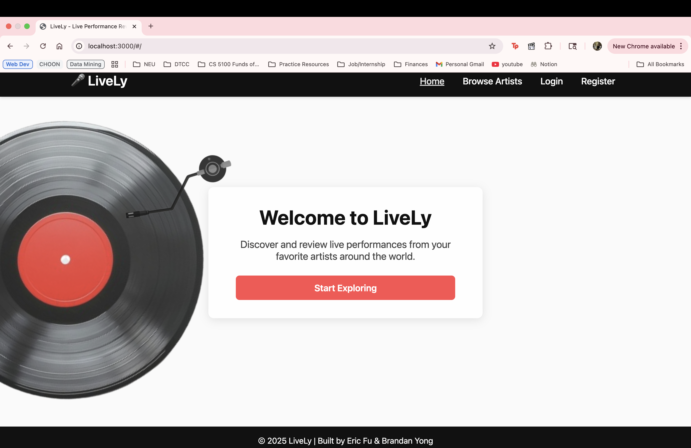

# Project 2

Lively

## Authors

Eric Fu & Brandan Yong

## Class Link

CS 5610 Web Development - Northeastern University https://johnguerra.co/classes/webDevelopment_fall_2025/

## Project Objective

Lively is an application for users to view and leave reviews on live performances by music artists. While there are applications that allow people to review albums or tracks, Lively focuses on helping users learn about what their favorite artists are like as live performers before spending money on concert tickets.

## Screenshot

## Instructions to Build

1. Clone the repository
2. Copy `.env.example` to `.env` and fill in your MongoDB credentials
3. Run `npm install`
4. Run `npm start`
5. Open browser to `http://localhost:3000`

## License

MIT

## Link to Deployment

http://lively-ifx9.onrender.com/#/