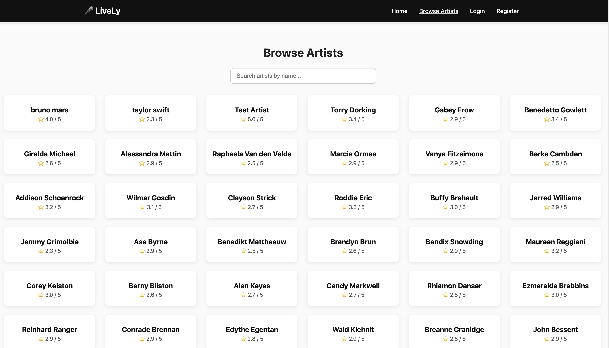
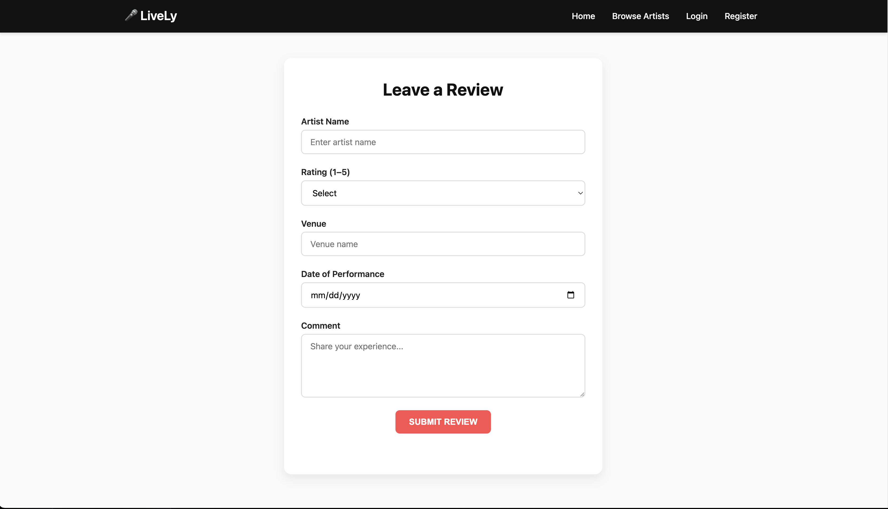
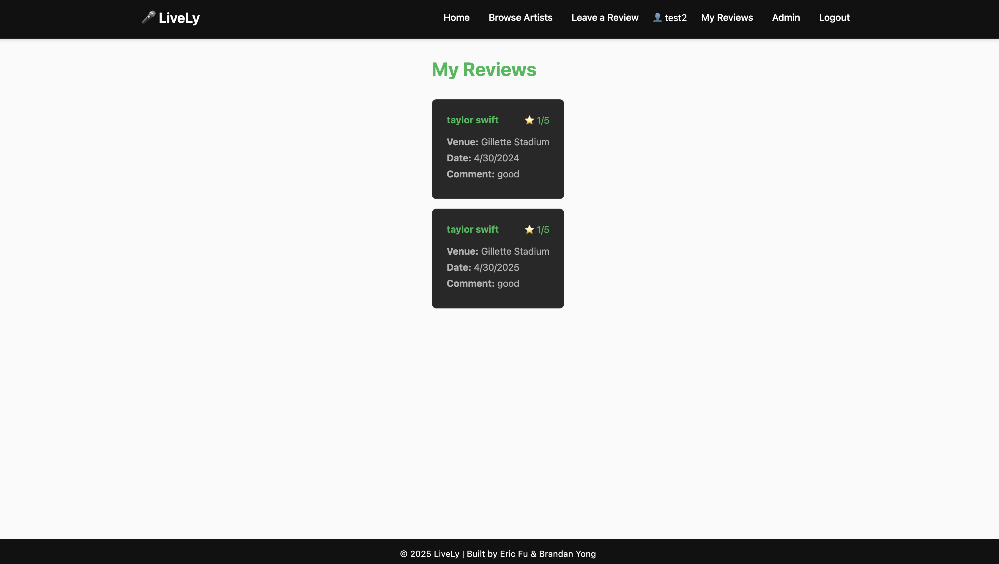
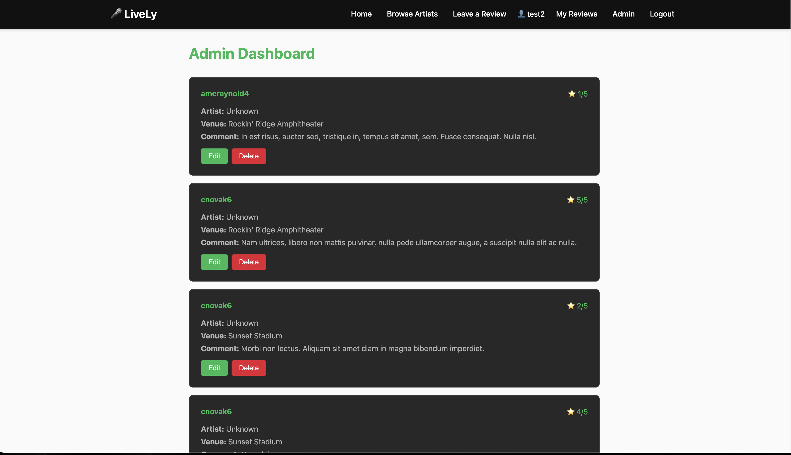

# Project 2

Lively

## Authors

Eric Fu & Brandan Yong

## Class Link

CS 5610 Web Development - Northeastern University https://johnguerra.co/classes/webDevelopment_fall_2025/

## Project Objective

Lively is an application to help music fans make informed decisions about attending a live concert. This is done via a dedicated platform where users can review and discover live music performances. Specifically, Lively addresses the gap between an artist’s recorded work versus the quality of their live performance as an overall experience, allowing potential concert-goers to avoid expensive disappointments, while discovering exceptional live performers. 

This is done on a community-driven platform where users share and discover authentic concert reviews. Users can leave reviews for a specific artist that includes, artist name, venue, specific date seen, a 1-5 star rating, and a personal narrative from the reviewer. To discover artists, users can search and browse artists by name to research an upcoming event and also read aggregated community feedback to allow confident purchasing decisions. The platform automatically creates artist profiles when users review new performers, growing the database organically. Registered users build personal concert diaries while contributing to the community, and administrators maintain content quality through moderation tools.

Built with Node.js, Express, MongoDB, and vanilla JavaScript, Lively prioritizes performance, security, and ease of use to serve music fans, festival-goers, venue managers, and anyone seeking authentic live music insights.

## Screenshot

## Instructions to Build

1. Clone the repository
2. Copy `.env.example` to `.env` and fill in your MongoDB credentials
3. Run `npm install`
4. Run `npm start`
5. Open browser to `http://localhost:3000`

## License

MIT

## Link to Deployment

http://lively-ifx9.onrender.com/#/

## Link to Public Video 

https://www.youtube.com/watch?v=ozXAzUvOt64

## Link to Design Document

https://docs.google.com/document/d/1cConP3pvrK_q2V4XnvMrlZWvJ9eqc8SeA9qIuaE-sDw/edit?usp=sharing
